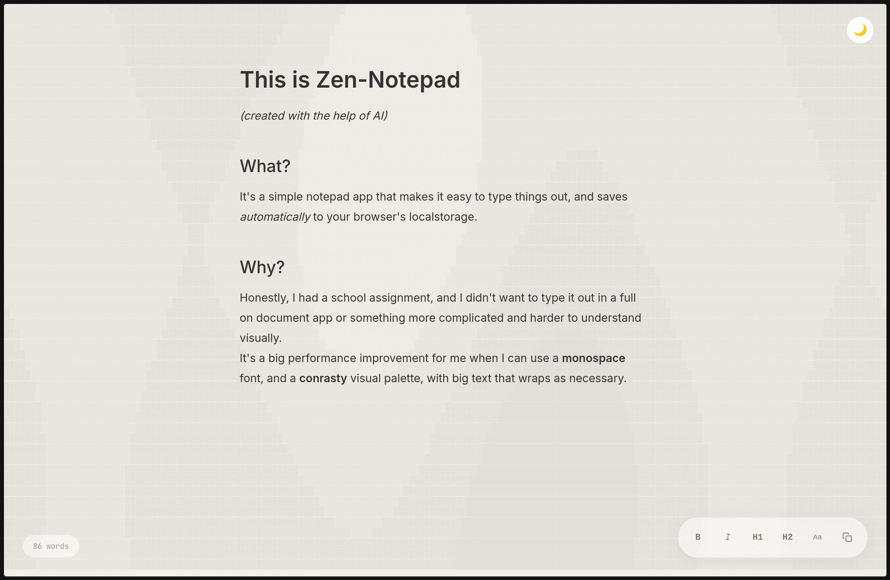
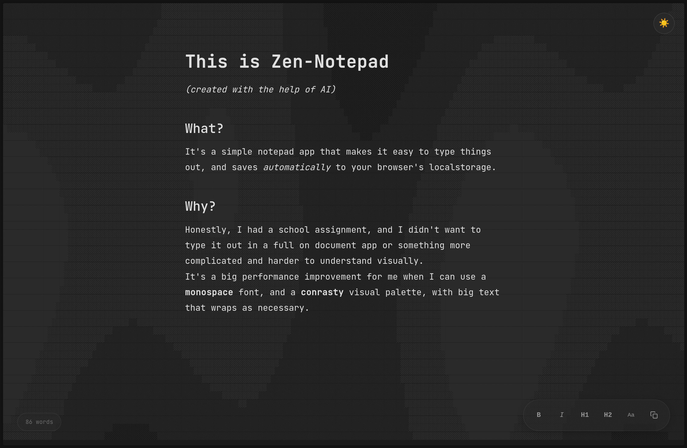

# Zen Notepad

A minimalist, distraction-free notepad with a zen aesthetic.
Built with vanilla HTML, CSS, and JS—no build tools or dependencies required.





## Features

### 🌊 Animated ASCII Wave Background

A subtle, animated background featuring wave patterns created with block characters
(`█▓▒░·`). The animation uses sine and cosine functions to create a calming,
ever-changing visual effect.

### ✍️ Rich Text Editor

- **Contenteditable** interface for natural writing
- **Three font options**: Sans, Serif, Mono
- **Formatting tools**: Bold, Italic, H1, H2 headings
- **Tab key support**: Inserts 4 spaces for indentation

### 📋 Markdown Export

The copy button exports your formatted text as Markdown, preserving:

- Headings (`# H1`, `## H2`)
- Bold text (`**bold**`)
- Italic text (`*italic*`)
- Line breaks and paragraphs

### 🌓 Dark/Light Theme

- Toggle between warm cream (`#F0EEE6`) and deep gray (`#1a1a1a`) themes
- Theme preference saved to localStorage
- Smooth transitions between modes

### 💾 Auto-save

- Content automatically saves to localStorage 500ms after you stop typing
- Font selection persists across sessions
- Theme preference persists across sessions
- Never lose your work

### 📊 Word Counter

- Real-time word count displayed in the bottom-left corner
- Updates as you type
- Handles singular/plural grammar ("1 word" vs "N words")

### 🎨 Minimalist UI

- Floating toolbar (bottom-right) with hover-to-reveal opacity
- Theme toggle button (top-right)
- No distracting UI elements while writing
- Responsive design for mobile and desktop

## Usage

1. Open `index.html` in any modern web browser
2. Start typing in the editor area
3. Use the toolbar buttons to format your text
4. Click the font button (`Aa`) to cycle through font options
5. Click the copy button to copy your text as Markdown
6. Toggle the theme with the 🌙/☀️ button in the top-right

## Keyboard Shortcuts

| Key    | Action             |
|--------|--------------------|
| `Tab`  | Insert 4 spaces    |

## Technical Details

- **No build process**: Pure HTML/CSS/JS
- **No external dependencies**: Google Fonts loaded via CDN
- **LocalStorage**: Used for persisting content and preferences
- **Clipboard API**: For copying formatted markdown
- **requestAnimationFrame**: For smooth ASCII background animation

## Browser Support

Works in all modern browsers that support:

- `contenteditable`
- CSS custom properties (variables)
- Clipboard API
- localStorage

## File Structure

```text
.
├── index.html          # Main application
├── assets/
│   ├── favicon.svg     # Notepad icon
│   ├── screenshot-light.png  # Light theme screenshot
│   └── screenshot-dark.png   # Dark theme screenshot
├── site.webmanifest    # PWA manifest
└── README.md           # This file
```

## Local Development

To run locally with a simple HTTP server:

```bash
python3 -m http.server 8000
# Open http://localhost:8000
```

Or simply open `index.html` directly in your browser.

## License

MIT License - feel free to use, modify, and distribute.

## Credits

Inspired by the reflection project by Chris McLeod.
